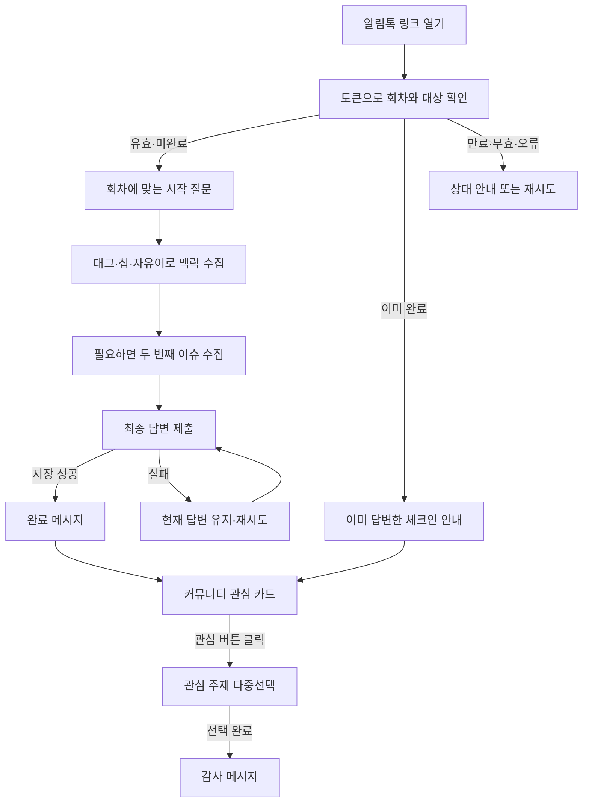
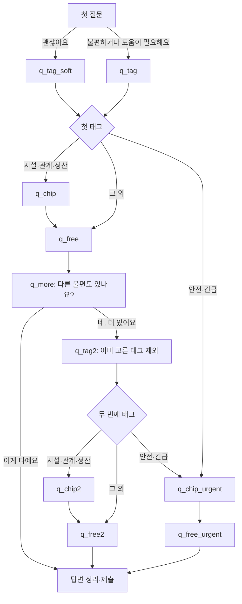
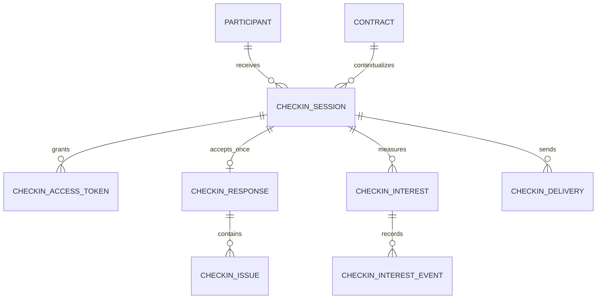
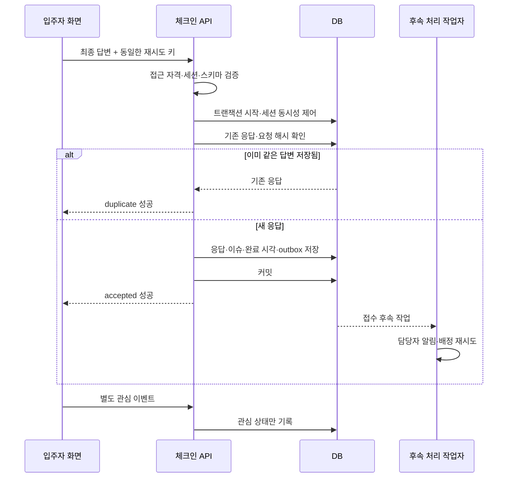

# 정기 체크인 v2 — 사용자 흐름·제품 의도·백엔드 연동 설계

> 이 문서는 백엔드 구현 전 프론트 분석·설계 기록입니다. BE-A~D 구현 이후의 실행·DB 연결·검증 안내는 [백엔드 개발·운영 준비](backend-development.md)를 참고하세요.

> - 작성일: 2026-09-06
> - 기준 레포: `hometogether-checkin-web`
> - 구현 기준: `c27bea2` — PR #5 병합 후 `main`
> - 문서 대상: 기획자, 프론트엔드 개발자, 백엔드 개발자, 체크인 운영 담당자
> - 구현 상태: 입주자 프론트와 목 API 완료. 실제 인증·DB·발송·상담원 알림·상담 처리는 미구현.
이 문서는 사용자와 확정한 v2 흐름을 설명하고, 현재 코드가 실제로 보내는 데이터를 기준으로 백엔드의 책임과 계약을 제안한다. 기존 프론트 설계 §14 이후에 확정한 **“일반 이슈는 자유어를 받은 뒤 추가 이슈를 묻는다”**는 순서가 우선한다.

문서에서 **[현재]**는 코드로 확인한 동작, **[제안]**은 백엔드 연동 시 채택할 설계, **[결정 필요]**는 아직 제품·운영 합의가 필요한 사항이다. 제안된 테이블과 HTTP API는 생성하거나 배포하지 않았다. 특정 DB·백엔드 프레임워크를 전제로 하지 않는다.

## 목차

1. 제품의 목적과 데이터의 의미
2. 전체 사용자 여정과 각 요소의 의도
3. 일반·긴급 이슈 흐름
4. 회차별 시나리오
5. 태그·예측 칩·주제 코드 사전
6. 자유어·이슈 정리·트리아지 규칙
7. 완료·오류·재진입 상태
8. 완료 후 커뮤니티 관심 조사
9. 현재 프론트 데이터 계약과 예시
10. 권장 백엔드 데이터 구조
11. 권장 API 계약
12. 인증·중복 제출·트랜잭션·상담원 연결
13. 회차 생성·발송·다음 회차 연결
14. 지표 정의와 해석
15. 연동 검증 시나리오
16. 구현 차이·결정 사항·권장 착수 순서
17. 코드 근거

## 1. 제품의 목적과 데이터의 의미

### 1.1 무엇을 해결하는가

정기 체크인은 입주자가 먼저 상담을 요청할 만큼 크지 않거나, 어떻게 말해야 할지 몰라 남겨둔 불편을 주기적으로 발견하는 접점이다. 최종 목적은 **개입할 문제가 있는지 파악하고, 담당 매니저가 연락할 때 필요한 맥락을 확보하는 것**이다.

설문 완료율만 높이는 것보다 다음 세 가지를 함께 본다.

- 문제 발견: 처음에는 괜찮다고 답한 사람에게도 실제 신고가 있는가?
- 맥락 확보: 어떤 분야의 어떤 문제이며, 입주자는 어떻게 설명하는가?
- 후속 조치: 접수된 문제를 담당자가 확인하고 처리할 수 있는가?

만족도 점수나 NPS, 자유어의 감정 분석은 현재 범위가 아니다. 재계약 의향도 만족도 점수와 동일하게 해석하지 않는다.

### 1.2 백엔드가 분리해야 할 네 가지

| 개념 | 뜻 | 동일시하면 생기는 문제 |
| --- | --- | --- |
| 체크인 세션 | 특정 입주자에게 특정 회차에 부여한 응답 기회 | URL 클릭마다 새 세션을 만들면 중복 응답과 분모가 늘어남 |
| 체크인 응답 | 그 회차에 제출한 최종 답변 한 건 | 첫 질문의 `ok`만 보고 최종적으로도 문제가 없다고 오판 |
| 신고 이슈 | 응답 안에 포함된 개별 불편 사항 | 두 이슈를 하나의 메모로 합치면 분류·담당 배정·설명 연결이 어려움 |
| 커뮤니티 관심 | 완료 후 별도 공간에 대한 관심 신호 | 설문을 완료했지만 관심이 없는 사람을 설문 미완료로 취급하게 됨 |

상담원의 처리 건(case)은 신고 이슈와도 별개다. **설문 제출 완료는 문제가 해결됐다는 뜻이 아니다.** 또한 매달 같은 누수를 신고했다고 실제 누수 사건이 매달 새로 생긴 것은 아니다.

### 1.3 범위와 원칙

**[현재]** 입주자 대상 온보딩 D+7, 첫 월간, 일반 월간, 재계약, 시설 이벤트, 규칙 이벤트를 지원한다. 팝업·`window.open`·localStorage 의존 없이 같은 페이지에서 진행한다. 분기와 R1/R2 판정은 결정론적이며 ML을 사용하지 않는다.

**[범위 밖]** 집주인 설문, NPS 재도입, 실제 커뮤니티, AI 집계, 시설 수리 상태 DB, 알림톡 스케줄러와 실제 DB는 이번 프론트 구현에 포함하지 않았다. 이 문서의 발송·상담 처리 항목은 연동을 위한 경계 제안이다.

## 2. 전체 사용자 여정과 각 요소의 의도



위 다이어그램은 서비스 전체 개요다. 긴급 이슈는 두 번째 이슈 질문을 생략하며, 이벤트는 태그 선택 없이 이미 정해진 맥락에서 시작한다. 상세 예외는 §3·§4에 정리한다.

| 요소 | 사용자에게 하는 일 | 설계 의도 | 백엔드 의미 |
| --- | --- | --- | --- |
| 토큰 링크 | 로그인 없이 본인 회차로 진입 | 카카오 인앱에서 진입 부담 축소 | 토큰이 세션·입주자·계약을 연결해야 함 |
| 이름·회차 인사 | 지금 왜 묻는지 설명 | 무작위 조사 느낌을 줄이고 맥락 제공 | 현재 계약과 회차에 맞는 표시 정보 제공 |
| 첫 질문 | 괜찮은지, 도움이 필요한지 확인 | 쉽게 대화를 시작 | 초기 자기평가를 별도 값으로 보존 |
| 부드러운 태그 질문 | 긍정 응답 뒤에도 사소한 불편 확인 | 무의식적이거나 말하기 애매한 불편 발굴 | `initial=ok`와 `final=reported`가 함께 존재할 수 있음 |
| 일반 태그 질문 | 불편의 큰 분야 선택 | 상담 분류와 다음 선택지 결정 | `tag`는 집계·업무 분류 코드 |
| 예측 칩 | 자주 발생하는 유형 중 하나 선택 | 설명 부담을 줄이고 분류를 구체화 | 미리 정의한 선택지이며 AI 예측 결과가 아님 |
| 자유어 | 방금 선택한 문제를 본인 말로 설명 | 상담원이 상황을 이해하도록 보완 | 이슈별 메모. 작성 여부와 본문을 구분 |
| 건너뛰기 | 글을 쓰지 않고도 다음으로 이동 | 입력이 어려워서 설문 전체를 포기하는 것을 줄임 | 빈 설명이 태그 신고를 취소하지 않음 |
| 더 있어요? | 추가 불편 한 건 확인 | 복수 문제를 분리해서 수집 | 최대 두 이슈. 첫 메모와 둘째 메모를 별도 저장 |
| 긴급 경로 | 긴급 분류 후 칩·설명만 받고 종료 | 필요한 맥락을 받고 불필요한 루프는 줄임 | R1은 태그 기반. 설명의 상세함에 따라 낮추지 않음 |
| 완료 메시지 | 정상 접수됐다고 알려줌 | 제출 성공을 명확히 전달 | DB 접수 성공 이후 표시해야 함 |
| 커뮤니티 카드 | 다른 입주자의 생활에 대한 관심 확인 | 기능 개발 전 수요 검증 | 설문과 독립된 이벤트·레코드 |
| 로고·폰트 | 홈투게더가 묻는 대화임을 표시 | 브랜드 인지와 읽기 편의 | 답변 데이터 필드는 필요 없음 |

브랜드 화면의 근거는 [S10][s10], 대화 조립과 제출 후 카드 배치는 [S7][s7]에 있다.

## 3. 일반·긴급 이슈 흐름

### 3.1 일반 회차의 확정 순서

**[현재] 일반 이슈는 `태그 → 예측 칩 → 해당 이슈 자유어 → 더 있어요?` 순서다.** 자유어를 모든 이슈의 맨 뒤에서 한 번만 받는 구조가 아니다. 근거: [S2][s2], [S3][s3], [S4][s4].



| 스텝 | 메시지·역할 | 다음 동작 |
| --- | --- | --- |
| `q_tag_soft` | “다행이에요! 혹시 아주 사소하게라도 신경 쓰였던 건 없으셨어요?” | 일반 태그 질문과 같은 5개 태그 |
| `q_tag` | “어떤 점이 불편하셨어요? 편하게 골라주세요.” | 태그별 경로 |
| `q_chip` | “조금만 더 자세히 알려주시겠어요?” | 어떤 칩을 골라도 첫 이슈 자유어 |
| `q_free` | “이 불편에 대해 더 알려주실 내용이 있으면 편하게 적어주세요.” | 작성·건너뛰기 모두 `q_more` |
| `q_more` | “혹시 다른 불편한 점도 있으세요?” | 예: 두 번째 태그 / 아니오: 제출 |
| `q_tag2` | “어떤 점이 더 불편하셨어요?” | 첫 태그를 제외하고 단일 선택 |
| `q_chip2` | “그것도 조금 더 알려주시겠어요?” | 두 번째 이슈 자유어 |
| `q_free2` | 두 번째 불편의 설명 | 작성·건너뛰기 모두 제출 |
| `q_chip_urgent` | “어떤 도움이 필요하신가요?” | 긴급 자유어 |
| `q_free_urgent` | “담당 매니저가 상황을 파악할 수 있도록 조금 더 알려주세요.” | 작성·건너뛰기 모두 제출, 루프 없음 |

### 3.2 문제없는 사람은 어떻게 종료하는가

별도의 “정말 아무 문제 없어요” 버튼은 없다. 다음 경로로 종료한다.

`괜찮아요 → 그 외 → 자유어 건너뛰기 → 이게 다예요 → ok 완료`

첫 질문에서 “불편한 게 있어요”라고 답했어도 마지막에 `other`만 있고 설명이 없으면 현재 공통 흐름은 `ok`로 정리한다. 첫 질문 값은 변경하지 않는다. 이때 첫 질문과 최종 결과가 다른 것은 데이터 오류가 아니라 서로 다른 정보를 기록한 결과다.

**해석상 주의:** 태그 화면을 반드시 지나므로 태그 클릭 수를 실제 신고 수로 쓰면 안 된다. 실질적 신고는 최종 제출 시 정리된 `issues`를 기준으로 센다. 이 흐름은 사소한 불편을 찾는 대신 문제없는 사람에게도 추가 단계를 요구한다. 이후 이탈률과 함께 평가해야 한다.

### 3.3 자유어와 루프의 상한

- 자유어 화면을 거치는 것은 필수이고, 글 작성은 선택이다.
- “더 있어요?”는 첫 일반 이슈의 자유어 뒤에서 한 번만 묻는다.
- 두 번째 이슈의 자유어 뒤에는 세 번째 태그나 공통 마무리 자유어를 다시 표시하지 않는다.
- 세 번째 이상 불편은 현재 자유어에 함께 적을 수 있지만 별도 구조화는 하지 않는다.
- 같은 태그를 두 번 선택할 수 없다. 같은 시설 태그 안의 두 문제도 별도 칩 두 개로 저장되지 않으며 자유어로 설명해야 한다.
- 진행 중에는 빈 `other`도 선택한 이슈로 남는다. 제출 시 제거하므로 최종 이슈 수가 1개여도 실제로는 두 번의 이슈 입력 기회를 모두 사용했을 수 있다.

### 3.4 긴급 경로의 의도와 저장 시점

긴급도 상담원이 내용을 알아야 하므로 예측 칩과 자유어를 모두 제공한다. 예측 칩의 `none`이나 자유어 건너뛰기를 선택해도 R1을 유지한다. 첫 이슈가 일반이고 두 번째가 긴급이면 두 이슈의 설명을 모두 보존하고 전체 우선순위를 R1로 올린다.

**[현재] “태그 선택 즉시 R1”은 브라우저 메모리 상태 변경이다.** 서버 요청은 최종 제출 때만 한다. 따라서 긴급 태그 선택 후 화면을 닫으면 상담원에게 자동 통보되는 구현은 없다. 태그 클릭 즉시 별도 긴급 신호를 저장하려면 새로운 제품 정책·API·프론트 작업이 필요하다. 이 문서는 이를 이미 구현된 기능으로 가정하지 않는다.

## 4. 회차별 시나리오

회차는 사람이 아닌 응답 기회의 종류다. 한 입주자에게 여러 회차가 생긴다. 실제 발송 시점·중복 회차 우선순위는 서버에서 정해야 한다. [S5][s5]

| `roundType` | 실행 시나리오 ID | 시작과 제품 의도 | 저장되는 주요 값 |
| --- | --- | --- | --- |
| `onboarding-d7` | `onboarding-d7-guest` | 입주 약 일주일 후 적응과 초기 도움 필요 확인 | `onboardingStatus`: `ok` / `issue` |
| `monthly-first` | `monthly-first-guest` | 첫 한 달 생활·정산 경험 확인 | `firstMonthStatus`: `ok` / `issue` |
| `monthly` | `monthly-guest` | 일상 생활·관계·시설·정산 문제 주기적 발견 | `monthlyStatus`: `ok` / `issue` |
| `monthly-renewal` | `monthly-renewal-guest` | 재계약 의향과 남은 기간에 필요한 지원을 분리해 확인 | `renewalIntent`, `renewalSupportStatus` |
| `event` + `facility` | `facility-event-guest` | 이전 시설 문제의 후속 상태 확인 | `facilityEventStatus`: `resolved` / `unresolved` |
| `event` + `rule` | `rule-event-guest` | 안내한 생활 규칙에 대한 이해·도움 필요 확인 | `ruleEventStatus`: `understood` / `needs-help` |

**[현재]** 온보딩과 첫 월간은 공통 이슈 팩토리를 사용한다. 일반 월간은 같은 흐름을 별도 데이터로 정의한다. 첫 월간에 독립 `q_relation` 질문이 있거나 재계약에 NPS가 있다고 가정하면 안 된다. 현재 코드에는 없다.

### 4.1 재계약

`q_intent → q_support → q_tag_soft 또는 q_tag → 공통 이슈 흐름`

| 질문 | 값 | 의미 |
| --- | --- | --- |
| 재계약 의향 | `renew` | 계속 거주 희망 |
| 재계약 의향 | `considering` | 아직 고민 중 |
| 재계약 의향 | `move-out` | 이사 예정 |
| 필요한 도움 | `none` | 지금은 괜찮음, soft 태그로 진행 |
| 필요한 도움 | `needed` | 도움이 필요함, 일반 태그로 진행 |

재계약 시나리오는 팩토리의 `q_main`을 통과하지 않는다. 첫 의향과 도움이 필요한지는 독립 정보이며 `move-out` 자체를 R1·R2 신고로 분류하지 않는다. 현재 실제 종료 결과는 `ok/reported/urgent`다. 타입에 남아 있는 `renewal` 완료값을 재계약의 필수 결과로 사용하지 않는다.

### 4.2 시설 이벤트

- `resolved` → 체크인 전체 자유어 → 제출.
- `unresolved` → `facility` 이슈 자동 생성 → 시설 칩 → 이슈 자유어 → `reported` 제출.
- 태그를 고르거나 추가 이슈 루프를 돌지 않는다.

### 4.3 규칙 이벤트

- `understood` → 체크인 전체 자유어 → 제출.
- `needs-help` → `other` 이슈 자동 생성 → 이슈 자유어 → `reported` 제출.
- 도움 요청은 명시적이므로 자유어를 건너뛰어도 `other` 이슈를 삭제하지 않는다.

두 이벤트의 긍정 경로에서 자유어를 작성하면 현재 엔진은 `answers.freeText`에 저장하고 같은 본문을 가진 `other` 이슈도 생성하여 R2·`reported`로 처리한다. 따라서 **“시설은 해결됐음”과 “다른 의견이 있어 reported”가 동시에 성립**할 수 있다. 원래 시설 건의 상태는 `facilityEventStatus`로 확인해야 한다.

**[결정 필요]** 단순 감사 인사도 비어 있지 않은 자유어이므로 현재는 `reported`다. 의미 분석은 하지 않는다. 시설 긍정 응답 뒤 의견을 남기면 완료 카피가 기존 `reported` 문구인 “아직 불편하시군요”로 표시되는 점도 후속 카피 검토 대상이다.

### 4.4 지원하지 않는 조합

집주인이나 eventContext 없는 이벤트는 현재 `chat-preview-guest`로 fallback한다. preview는 개발용 짧은 흐름이며 v2 운영 시나리오로 간주하지 않는다. **[제안]** 백엔드는 미지원 조합을 발급하지 않고, 실제 연동 시 프론트도 명시적 미지원 안내로 교체한다.

## 5. 태그·예측 칩·주제 코드 사전

라벨은 바꿀 수 있지만 저장 코드는 안정적으로 유지한다. 코드를 재사용해 다른 의미를 부여하지 않는다. 예측 칩은 태그별 정적 목록이다. [S6][s6]

### 5.1 이슈 태그

| 코드 | 화면 라벨 | 현재 우선순위 | 역할 |
| --- | --- | --- | --- |
| `facility` | 🔧 시설·수리 | R2 | 물리적인 시설·설비 불편 |
| `relationship` | 🏠 집주인과의 관계 | R2 | 소통·간섭·생활 규칙 등 관계 문제 |
| `settlement` | 💰 정산·비용 | R2 | 공과금·보증금·추가비용 등 |
| `urgent` | ⚠️ 안전·긴급 | R1 | 우선 확인이 필요한 안전·도움 요청 |
| `other` | 그 외 | R2 또는 제출 시 제거 | 기존 분류에 담기지 않는 의견 |

### 5.2 예측 칩

| 태그 | 코드 → 라벨 |
| --- | --- |
| `facility` | `leak` → 누수·물샘 / `climate` → 난방·에어컨 / `mold` → 곰팡이·습기 / `lock` → 문·잠금 / `pests` → 벌레·해충 / `electricity` → 전기·조명 |
| `relationship` | `communication` → 소통이 어려워요 / `interference` → 간섭이 부담돼요 / `rules` → 규칙이 불편해요 / `visitors` → 방문객 관련 / `noise` → 소음·생활습관 |
| `settlement` | `utilities` → 공과금이 이상해요 / `extra-cost` → 추가비용 요구 / `deposit` → 보증금 관련 / `settlement-date` → 정산일 문제 |
| `urgent` | `gas-electricity` → 가스·누전 / `unlocked-door` → 문 안 잠김 / `personal-safety` → 신변 불안 / `immediate-help` → 즉시 도움 필요 |

위 네 태그 모두 마지막에 `none` → “해당 없음”, `free` → “그 외 (직접 입력)”을 갖는다. `other`의 옵션 데이터에는 `free`가 있지만 현재 시나리오는 태그에서 자유어로 바로 이동하므로 그 칩 화면을 보여주지 않는다.

| 값 | 정확한 의미 | 저장 시 주의 |
| --- | --- | --- |
| `detail` 없음 | 해당 경로에서 칩을 묻지 않음 | `none`으로 자동 변환하지 않음 |
| `detail: "none"` | 태그는 맞지만 세부 선택지에 해당 없음 | 태그 신고는 유지 |
| `detail: "free"` | 예측 목록 외 내용을 직접 설명하려고 선택 | 자유어를 건너뛰더라도 선택 값은 유지 |

### 5.3 커뮤니티 관심 주제

| 코드 | 라벨 |
| --- | --- |
| `kitchen` | 주방·요리 |
| `daily-life` | 소음·생활습관 |
| `cleaning` | 청소·위생 |
| `host` | 집주인과 지내기 |
| `costs` | 비용·정산 |
| `other` | 그 외 |

관심 주제는 다중선택이고 이슈 태그는 단일선택이다. `interest.other`는 신고 이슈가 아니며 자유어 입력을 추가로 열지 않는다. 서로 다른 코드 사전으로 관리한다.

## 6. 자유어·이슈 정리·트리아지 규칙

### 6.1 두 종류의 자유어

| 저장 위치 | 현재 사용 경로 | 설명 |
| --- | --- | --- |
| `answers.issues[i].freeText` | 일반·긴급·이벤트 신고 경로 | 해당 이슈에 붙는 설명 |
| `answers.freeText` | 이벤트의 긍정 응답 후 추가 의견 | 체크인 전체 메모. 현재 이 경로에서는 같은 본문의 `other` 이슈도 생성 |
| `answers.responses.*FreeText` 또는 `responses.freeText` | 입력 화면 통과 기록 | 본문이 아니라 `provided` / `skipped` |

자유어 화면에 “보내기”와 “건너뛰기”가 있다. **각 자유어의 “보내기”는 그 스텝의 답변 확정이지 항상 서버 제출은 아니다.** 첫 일반 이슈에서는 이후 `q_more`로 이동한다.

본문은 앞뒤 공백을 제거하고 최대 500자로 제한한다. 빈 문자열·공백만 입력하면 `skipped`다. 현재 JS의 `.length`와 `.slice()` 기준은 UTF-16 코드 단위이므로 이모지 등이 포함되면 다른 언어의 문자열 길이와 다를 수 있다. **[제안]** 서버에서도 동일한 길이 계약을 적용하거나 양측이 함께 길이 정의를 변경한다. DB 칼럼 길이만 믿고 검증을 생략하지 않는다.

### 6.2 신고 정리 규칙

공통 이슈 흐름과 이벤트 긍정 경로는 `complete-from-answers`에서 정리한다.

1. `other`가 아닌 태그는 설명이 없어도 유지한다.
2. `other`는 해당 이슈의 설명 또는 체크인 전체 설명이 있으면 유지한다.
3. 빈 `other`는 제거한다.
4. 남은 이슈로 전체 트리아지를 다시 계산한다.
5. R1이 있으면 `urgent`, 그 외 이슈나 전체 설명이 있으면 `reported`, 아무것도 없으면 `ok`다.

이벤트의 명시적 도움 요청은 고정 `complete(reported)` 경로를 사용한다. 공통 정리 규칙으로 덮어쓰면 `ruleEventStatus=needs-help` 신고를 잃으므로 서버도 이 예외를 알아야 한다.

**[현재 계약의 특성]** 이슈 정리 후에도 `responses.issueTag=other`, `responses.issueFreeText=skipped` 같은 선택 기록은 남는다. 최종 `issues=[]`와 함께 존재할 수 있으며 정상 데이터다.

### 6.3 트리아지는 우선순위다

```text
issue.triageLevel = tag == urgent ? R1 : R2

overallTriage =
  R1 이슈가 하나라도 있으면 R1
  아니면 이슈가 하나라도 있으면 R2
  아니면 값 없음
```

태그가 `facility`이고 칩이 `electricity`라도 현재 규칙은 R2다. 자유어에 특정 단어가 있거나 설명이 길다고 자동 R1이 되지 않는다. 칩·키워드 기반 승격을 원하면 별도 결정론적 정책과 버전이 필요하다. 현재 구현을 문서에서 임의로 확장하지 않는다. [S11][s11]

| 응답 예 | 최종 이슈 | 전체 트리아지 | 완료 결과 |
| --- | --- | --- | --- |
| 괜찮음 → other → 건너뛰기 → 추가 없음 | 없음 | 없음 | `ok` |
| 괜찮음 → 시설 → none → 건너뛰기 → 추가 없음 | 시설 | R2 | `reported` |
| 관계 → free → 건너뛰기 → 추가 없음 | 관계 | R2 | `reported` |
| other → 실제 설명 → 추가 없음 | 기타 | R2 | `reported` |
| 시설 설명 + 긴급 설명 | 시설·긴급 | R1 | `urgent` |
| 긴급 → none → 건너뛰기 | 긴급 | R1 | `urgent` |
| 규칙 이벤트 needs-help → 건너뛰기 | 기타 | R2 | `reported` |
| 시설 이벤트 resolved → 추가 설명 작성 | 기타 | R2 | `reported` |

**[제안]** 서버가 태그와 시나리오 버전에 따라 우선순위·완료 결과를 다시 계산한다. 클라이언트가 보낸 `triageLevel`을 권한 있는 판정으로 신뢰하지 않는다. 상담원이 이후 우선순위를 수정하면 최초 규칙 판정과 운영상 수정 판정을 분리해서 보관한다.

## 7. 완료·오류·재진입 상태

### 7.1 페이지 상태와 설문 상태는 다르다

| 구분 | 상태 | 사용자에게 보이는 것 | 서버에 요구되는 의미 |
| --- | --- | --- | --- |
| 세션 조회 | `active` | 채팅 시작 | 인증된 세션에 새 응답을 제출할 수 있음 |
| 세션 조회 | `completed` | 이미 답변 안내 + 관심 카드 | 새 설문 작성 금지, 허용된 범위의 관심 기록은 가능 |
| 세션 조회 | `expired` | 기간이 지난 체크인 안내 | 미완료지만 응답 기간 종료 |
| 세션 조회 | `invalid` | 링크가 올바르지 않음 | 토큰 확인 불가 또는 사용할 수 없음 |
| 세션 조회 | `error` | 일시 오류·재시도 | 유효성 실패와 통신 장애를 혼동하지 않음 |
| 실행 중 | `active` | 한 스텝의 입력 컨트롤 | 진행 답변은 현재 브라우저에만 있음 |
| 실행 중 | `submitting` | 답변 저장 중 | 최종 한 번 제출 중 |
| 실행 중 | `completed` | 완료 메시지 + 관심 카드 | 응답 접수 성공을 확인함 |
| 실행 중 | `error` | 같은 답변으로 재시도 | 새 응답 작성이 아니라 같은 제출의 재시도 |

`resolving`은 라우트의 로딩 UI이며 DB 상태로 저장할 필요는 없다. `submitting/error`도 대체로 클라이언트 요청 상태다. 이를 그대로 세션 DB enum으로 복제하지 않는다.

### 7.2 완료 메시지의 약속

- `ok`: 회차에 맞는 감사·다음 체크인 안내.
- `reported`: “빠르게 확인하고 연락드릴게요” 등의 접수 안내.
- `urgent`: “바로 확인해서 담당 매니저가 연락드릴게요”라는 우선 확인 안내.

**[현재]** 메시지는 제출 함수가 성공한 이후에만 붙는다. 관심 카드도 이때 표시한다. 관심 조사에 응답하지 않고 닫아도 설문은 완료다.

**[제안]** 실제 백엔드의 “성공”은 적어도 응답과 이슈의 영속 저장, 필요한 후속 처리 예약의 성공을 뜻해야 한다. 상담원에게 실제 알림이 도착했는지 또는 문제가 해결됐는지를 뜻하지 않는다. 실제 연락 목표 시간과 운영시간은 별도 확정해야 하며, 현재 코드가 특정 SLA를 보장하지 않는다.

### 7.3 현재 목 구현의 중요한 한계

- `submitCheckinAnswer`는 payload 검증 후 **idempotencyKey를 메모리 Set에 넣을 뿐, 답변 본문을 저장하지 않는다.**
- 목 세션 조회는 토큰별 고정 데이터를 반환한다. 실제 제출 결과를 보고 `active`를 `completed`로 바꾸지 않는다.
- 따라서 완료 후 새로고침하면 같은 목 토큰이 다시 `active`로 열릴 수 있다. `demo-completed`는 별도 고정 데모 상태다.
- 진행 중 새로고침·앱 종료 시 입력한 답변은 사라진다. “입력한 내용은 그대로 보관”이라는 재시도 안내는 같은 화면이 유지되는 동안의 메모리 보관을 뜻한다.
- 이미 완료된 링크의 `sessionId`는 관심 카드 기록용이다. 응답 본문이나 다른 사람의 정보를 반환하기 위한 값이 아니다.

근거: [S8][s8]. 이 동작은 실제 DB와 서버 인증으로 교체해야 할 목 경계다.

## 8. 완료 후 커뮤니티 관심 조사

### 8.1 무엇을 검증하는가

다른 입주자는 주방·소음·청소·집주인 관계·정산 문제를 어떻게 다루는지 궁금해하는 수요를 확인한다. 실제 커뮤니티를 구현하기 전에 관심 클릭과 주제를 기록하는 fake door다. 클릭은 커뮤니티 이용 실적이나 기능의 효과가 아니다.

**[현재]** 일반·긴급·이벤트 완료 모두 같은 카드를 보여준다. 이미 완료된 세션 안내 화면에도 표시한다. 긴급 완료자만 제외하는 필터는 현재 없다. [S7][s7], [S9][s9]

### 8.2 확정된 화면 카피

> 나만 이런가? 다른 분들은 어떻게 지내는지 궁금하셨죠?
>
> 같은 홈투게더에서 지내는 다른 입주자들은 비슷한 순간을 어떻게 보내는지 —
> 예를 들어 주방을 언제 쓰는지, 소음은 어떻게 조율하는지 —
> 익명으로 물어보고 볼 수 있는 공간을 준비하고 있어요.
> 관심 가져주시는 분이 많으면 더 빨리 만들어볼게요.
>
> [궁금해요, 알려주세요]

클릭 후:

> 관심 가져주셔서 감사해요! 준비되면 가장 먼저 알려드릴게요 😊
> 어떤 게 제일 궁금하세요? (여러 개 골라도 돼요)

§5.3의 주제 칩을 표시하고 `[선택 완료]` 후 “고마워요! 준비되면 알려드릴게요 🙂”로 종료한다. 실제 알림 발송 기능은 없다. 이 카피의 알림 약속을 실행하는 운영·발송 정책은 후속 설계가 필요하다.

### 8.3 기록 시점

| 이벤트 | 현재 발생 시점 | 담는 값 | 해석 |
| --- | --- | --- | --- |
| `exposed` | 카드가 IntersectionObserver 기준으로 화면과 교차할 때 | `sessionId` | 카드가 일부라도 보였다는 노출. 일정 시간 읽었다는 뜻은 아님 |
| `clicked` | 관심 버튼 클릭 | `sessionId` | 관심 표현 |
| `topics-submitted` | 선택 완료 버튼 클릭 | `sessionId`, `topics[]` | 최종 제출한 주제 목록 |

IntersectionObserver를 사용할 수 없으면 마운트 시 노출을 기록한다. 노출 기록이 성공하기 전까지 관심 버튼은 비활성이다. 저장 오류는 카드 안에서 재시도하며 설문 완료 상태를 취소하지 않는다.

**주제 칩을 누르는 순간마다 서버 저장하지 않는다.** 선택 중 배열은 로컬 상태다. 주제 두 개를 골랐어도 “선택 완료” 전에 닫으면 저장된 `topics`는 없다. 분석에서 이를 “아무 주제도 고르지 않았다”고 단정하면 안 된다.

| 저장 상태 | 뜻 |
| --- | --- |
| `exposedAt` 있음, `clicked=false` | 노출 후 아직 클릭 기록 없음 |
| `clickedAt` 있음, `topicsSubmittedAt` 없음 | 클릭했지만 주제 제출은 확인되지 않음 |
| `topicsSubmittedAt` 있음, `topics=[]` | 선택 완료 버튼을 눌렀지만 주제는 제출하지 않음 |
| `topicsSubmittedAt` 있음, `topics` 비어 있지 않음 | 하나 이상 주제 제출 |

### 8.4 중복·재진입과 수치 제목

현재 목은 `sessionId + community-interest:v1 + 이벤트 종류`로 각 이벤트를 한 번만 기록한다. 같은 세션의 두 번째 주제 제출은 최초 주제를 덮어쓰지 않는다. 재노출도 이미 선택한 상태를 초기화하지 않는다. 보장은 동일 JS 런타임에 한정된다.

`interestHookPercent?: number`는 현재 호출부에서 전달하지 않는다. 유효한 0~100 값이 있을 때만 수치 제목을 만들며 `0`도 유효하다. 백엔드는 나중에 집계값을 제공할 때 **분모·기간·대상·표본 수·실험 버전**을 함께 관리해야 한다. 지금은 수치와 집계 API를 만들어낸 상태가 아니다.

관심 조사의 익명 공간 소개는 **향후 커뮤니티 공간의 설명**이다. 현재 관심 측정 자체가 운영자에게 완전 익명이라는 뜻은 아니다. 다음 회차 참여와 연결하려면 서버가 세션을 입주자와 연결해야 한다.

## 9. 현재 프론트 데이터 계약과 예시

이 절의 타입·예시는 현재 코드와 호환된다. HTTP 경로나 인증 헤더가 정해졌다는 뜻은 아니다. [S1][s1], [S8][s8]

### 9.1 세션

```typescript
interface CheckinSession {
  id: string;
  personaType: "guest" | "host";
  roundType: "onboarding-d7" | "monthly" | "monthly-first" | "monthly-renewal" | "event";
  displayName?: string;
  eventContext?: { type: "facility"; itemName: string } | { type: "rule" };
}
```

현재 이 DTO에는 입주자 ID·계약 ID·호실 ID·시설 사건 ID·응답 기한·시나리오 버전이 없다. 서버가 세션 뒤에서 식별 관계를 관리하고 화면에 필요한 값만 돌려주는 구조를 제안한다. 시설의 `itemName`은 화면용 문자열이며 사건 식별자로 쓰지 않는다.

### 9.2 최종 제출

```typescript
interface CheckinSubmission {
  schemaVersion: 1;
  sessionId: string;
  idempotencyKey: string;
  answers: {
    responses: Record<string, string | number>;
    issues: Array<{
      tag: "facility" | "relationship" | "settlement" | "urgent" | "other";
      detail?: string;
      freeText?: string;
      triageLevel: "R1" | "R2";
    }>;
    freeText?: string;
    overallTriage?: "R1" | "R2";
  };
}
```

현재 요청에는 `scenarioId`, 완료 `outcome`, `transcript`, `currentStepId`, `token`, 입주자 ID가 없다. `schemaVersion: 1`은 **payload 형식 버전**이다. 제품명 “v2”와 다르며 현재 idempotencyKey의 `:v1`도 그대로 유지된다.

`responses`는 경로·선택 값의 요약, `issues`는 최종 신고, `transcript`는 화면용 대화다. 운영상 신고 조회는 `issues`를 사용하고, `responses`의 `issueTag`들을 추가 이슈로 다시 세지 않는다. 문자열 자유어 본문은 `responses`에 들어가지 않는다.

### 9.3 질문 키 사전

| 키 | 가능한 값 | 비고 |
| --- | --- | --- |
| `onboardingStatus`, `firstMonthStatus`, `monthlyStatus` | `ok`, `issue` | 해당 회차 키만 존재 |
| `renewalIntent` | `renew`, `considering`, `move-out` | 재계약 의향 |
| `renewalSupportStatus` | `none`, `needed` | 실제 재계약 경로의 지원 필요 여부 |
| `issueTag`, `secondIssueTag` | §5.1 코드 | 최초·두 번째 태그 |
| `issueDetail`, `secondIssueDetail` | 해당 태그의 칩 코드 | 일반 태그의 세부 선택 |
| `issueFreeText`, `secondIssueFreeText` | `provided`, `skipped` | 일반 이슈별 작성 여부 |
| `urgentDetail` | 긴급 칩 코드 | 긴급이 첫째·둘째인지와 무관하게 이 키 사용 |
| `urgentFreeText` | `provided`, `skipped` | 긴급 설명 작성 여부 |
| `hasAnotherIssue` | `yes`, `no` | 첫 이슈가 긴급이면 존재하지 않음 |
| `facilityEventStatus` | `resolved`, `unresolved` | 시설 후속 상태 |
| `facilityEventDetail` | 시설 칩 코드 | 시설 미해결 경로 |
| `ruleEventStatus` | `understood`, `needs-help` | 규칙 확인 결과 |
| `freeText` | `provided`, `skipped` | 이벤트의 작성 여부. 같은 이름의 본문 필드와 구분 |

없는 키는 대부분 “묻지 않은 질문”이다. 자동으로 `no`, `none`, `skipped`를 채우지 않는다. 예를 들어 `hasAnotherIssue`가 없다는 이유로 추가 문제가 없었다고 해석하면 안 된다.

### 9.4 예시 A — 두 일반 이슈에 서로 다른 설명

아래 ID·본문은 계약 설명용 가상 데이터다.

```json
{
  "schemaVersion": 1,
  "sessionId": "example-monthly-two",
  "idempotencyKey": "example-monthly-two:monthly-guest:v1",
  "answers": {
    "responses": {
      "monthlyStatus": "issue",
      "issueTag": "facility",
      "issueDetail": "leak",
      "issueFreeText": "provided",
      "hasAnotherIssue": "yes",
      "secondIssueTag": "settlement",
      "secondIssueDetail": "utilities",
      "secondIssueFreeText": "provided"
    },
    "issues": [
      { "tag": "facility", "detail": "leak", "freeText": "천장에서 물이 떨어져요.", "triageLevel": "R2" },
      { "tag": "settlement", "detail": "utilities", "freeText": "이번 달 공과금 내역을 확인하고 싶어요.", "triageLevel": "R2" }
    ],
    "overallTriage": "R2"
  }
}
```

### 9.5 예시 B — 긍정 응답 후 실제 신고 없이 종료

```json
{
  "schemaVersion": 1,
  "sessionId": "example-monthly-ok",
  "idempotencyKey": "example-monthly-ok:monthly-guest:v1",
  "answers": {
    "responses": {
      "monthlyStatus": "ok",
      "issueTag": "other",
      "issueFreeText": "skipped",
      "hasAnotherIssue": "no"
    },
    "issues": []
  }
}
```

`overallTriage`는 JSON에서 생략한다. 현재 검증기는 이 자리에 `null`을 보내는 것을 허용하지 않는다. DB에서는 NULL로 저장할 수 있으나 전송 계약과 구분한다.

### 9.6 예시 C — 긴급 칩 후 설명 건너뛰기

```json
{
  "schemaVersion": 1,
  "sessionId": "example-urgent",
  "idempotencyKey": "example-urgent:monthly-guest:v1",
  "answers": {
    "responses": {
      "monthlyStatus": "issue",
      "issueTag": "urgent",
      "urgentDetail": "unlocked-door",
      "urgentFreeText": "skipped"
    },
    "issues": [{ "tag": "urgent", "detail": "unlocked-door", "triageLevel": "R1" }],
    "overallTriage": "R1"
  }
}
```

### 9.7 예시 D — 규칙 이벤트에서 명시적 도움 요청

```json
{
  "schemaVersion": 1,
  "sessionId": "example-rule-help",
  "idempotencyKey": "example-rule-help:rule-event-guest:v1",
  "answers": {
    "responses": { "ruleEventStatus": "needs-help", "freeText": "skipped" },
    "issues": [{ "tag": "other", "triageLevel": "R2" }],
    "overallTriage": "R2"
  }
}
```

### 9.8 예시 E — 시설은 해결됐지만 별도 의견을 작성

```json
{
  "schemaVersion": 1,
  "sessionId": "example-facility-comment",
  "idempotencyKey": "example-facility-comment:facility-event-guest:v1",
  "answers": {
    "responses": { "facilityEventStatus": "resolved", "freeText": "provided" },
    "issues": [{ "tag": "other", "freeText": "생활 규칙에 대해 문의하고 싶어요.", "triageLevel": "R2" }],
    "freeText": "생활 규칙에 대해 문의하고 싶어요.",
    "overallTriage": "R2"
  }
}
```

위의 두 본문은 현재 엔진이 같은 의견을 두 위치에 기록한 것이다. 상담원 화면에서 별개의 문의 두 건으로 표시하지 않는다.

### 9.9 별도 관심 이벤트 요청

세 객체는 세 번의 별도 호출이며 설문 payload에 추가하는 항목이 아니다.

```json
[
  { "sessionId": "example-monthly-ok", "type": "exposed" },
  { "sessionId": "example-monthly-ok", "type": "clicked" },
  { "sessionId": "example-monthly-ok", "type": "topics-submitted", "topics": ["kitchen", "daily-life"] }
]
```

현재 함수 반환값은 세션별 관심 스냅샷이다. `createdAt`, 각 이벤트 시각, 결정론적 `eventId`는 목 함수 안에서 만든다. 프론트 호출 인자가 임의 이벤트 시각을 전송하는 형태는 아니다.

## 10. 권장 백엔드 데이터 구조

이 절은 전부 **[제안]**이다. 기존 입주자·계약·시설 시스템의 DB 구조는 이 작업에서 확인하지 않았으므로 아래 `*_ref`의 실제 ID 형식·FK·소유 서비스는 연동 시 확정한다. 입주자 마스터나 시설 사건 DB를 체크인 서비스에 중복 구현하라는 제안이 아니다.

### 10.1 권장 경계와 관계

핵심은 세션·접근 토큰·최종 응답·응답 내 이슈·관심 기록이다. 발송, 상담 처리, 관심 이벤트 원장은 운영 요구에 맞춰 별도 테이블 또는 기존 서비스를 연결한다.



`PARTICIPANT`, `CONTRACT`는 논리적 외부 엔티티다. 별도 DB라면 실제 SQL FK 대신 서비스 간 ID 계약과 정합성 검증으로 연결한다. `CHECKIN_INTEREST`는 세션×실험별 한 건이며 현재 실험은 하나뿐이다.

### 10.2 checkin_session — 누구에게 언제 무엇을 물었나

| 필드 | 역할·제약 |
| --- | --- |
| `id` | 안정적인 세션 식별자. 프론트 `sessionId`와 대응 |
| `participant_ref` | 회차 간 동일 입주자를 연결하는 키. 관심 재참여 분석의 기준 |
| `contract_ref` | 이번 질문이 어떤 입주 계약에 관한 것인지 |
| `property_ref`, `room_ref` | 필요한 경우 계약 시스템에서 얻는 운영·집계 맥락 |
| `persona_type` | 현재 발급 허용값 `guest` |
| `round_type` | 현재 RoundType 코드 |
| `round_key` | 재시도·재발송에도 바뀌지 않는 업무상 회차 식별자 |
| `scenario_id`, `scenario_version` | 세션 생성 당시 질문·분기 버전 고정 |
| `triage_rule_version` | 서버가 적용할 판정 정책 버전 |
| `event_type`, `source_event_ref` | 이벤트 회차만 사용. 기존 시설·규칙 사건과 연결 |
| `event_context_snapshot` | 당시의 시설명 등 최소 표시 맥락. 자유어·PII를 무제한 복사하지 않음 |
| `status` | `open / completed / cancelled` 등의 영속 상태. 만료는 기한에서 계산 가능 |
| `created_at`, `available_at`, `answer_expires_at` | 생성·시작 가능·응답 마감 시각 |
| `completed_at` | 최종 응답이 커밋된 서버 시각 |

**제약 제안:** `(participant_ref, contract_ref, round_key)` 유일. 필요하다면 조직 범위 키도 포함한다. `round_key` 생성 규칙이 첫 월간과 일반 월간의 중복을 실제로 방지해야 한다. `round_type`만 조합한 unique로는 일정 충돌을 해결하지 못한다.

이름과 연락처는 가능하면 기존 계약·입주자 시스템에서 조회한다. 과거 표시 이름의 재현이 필요하면 제한된 스냅샷을 별도 보관한다. 클라이언트가 보낸 입주자 ID로 소유자를 정하지 않는다.


**시나리오 버전 연동 주의:** 현재 프론트 세션 DTO는 scenario_version을 받지 않고 배포된 최신 시나리오를 선택한다. 서버 DB에 과거 버전만 저장해 두어도 과거 질문이 자동 재현되지는 않는다. 실제 연동 시 세션 DTO에 버전을 추가하고 해당 버전의 프론트 시나리오를 선택하도록 하거나, 문항 변경 시 기존 미완료 회차를 어떻게 종료·이관할지 정책을 정해야 한다. 서버가 요구하는 버전과 화면이 실행하는 버전을 일치시킨다.

### 10.3 checkin_access_token — 접근 자격과 설문 권한

| 필드 | 역할·제약 |
| --- | --- |
| `id`, `session_id` | 토큰 레코드와 세션 연결 |
| `token_digest` | 충분히 무작위인 토큰 원문의 해시·다이제스트. 원문 대신 보관 |
| `created_at`, `expires_at`, `revoked_at` | 접근 자격 유효기간·폐기 |
| `scope` 또는 서버 권한 정책 | 세션 조회, 최초 설문 제출, 완료 후 관심 기록 허용 범위 |
| `last_used_at` | 필요한 경우 운영 관찰용. GET 한 번을 사람의 참여로 간주하지 않음 |

`token_digest` unique, `session_id` 조회 인덱스를 둔다. 재발송 때 같은 토큰을 쓰는지 새 토큰을 만드는지와 별개로 **같은 응답 기회에는 같은 session_id**를 유지한다.

**“일회성”은 이 세션의 최종 설문 제출이 한 번이라는 의미로 설계한다.** 첫 GET에서 토큰을 소비하면 알림톡 미리보기나 재시도 때문에 정상 사용자가 응답하지 못할 수 있다. 완료 후 관심 기록까지 즉시 차단하지 않도록 설문 쓰기 권한과 제한된 후속 접근 권한을 구분한다. 구체적인 인증 방식은 §12.1에 제안한다.

### 10.4 checkin_response — 최종 응답 한 건

| 필드 | 역할·제약 |
| --- | --- |
| `id`, `session_id` | 응답 ID, session_id unique로 세션당 한 번 보장 |
| `schema_version` | 현재 요청은 1 |
| `scenario_id`, `scenario_version`, `triage_rule_version` | 해석 당시 버전. 세션의 고정 버전에서 가져옴 |
| `idempotency_key`, `request_hash` | 전송 재시도 식별과 동일 키·다른 본문 검출 |
| `answers_json` | 정리·검증한 최종 응답 스냅샷 |
| `outcome` | 서버가 시나리오 규칙으로 계산한 `ok/reported/urgent` |
| `overall_triage` | `R1/R2/NULL` |
| `submitted_at` | 서버의 접수 완료 시각 |

**보관 원칙 제안:** `answers_json`을 최종 응답 원본으로 삼고, `checkin_issue`는 운영·검색용으로 같은 트랜잭션에서 생성한다. 이미 제출한 답변은 현재 제품에서 수정하지 않는다. 운영자 정정은 원본 응답을 덮어쓰기보다 이력·주석·별도 운영 필드로 관리한다.

`request_hash`는 키 순서 차이가 결과를 바꾸지 않도록 정규화한 요청 내용으로 계산한다. 세션·버전·답변의 의미 있는 값이 같아야 같은 재시도로 인정한다. 원문 토큰을 요청 해시에 포함하거나 로그에 남길 필요는 없다.

### 10.5 checkin_issue — 상담원이 볼 개별 불편

| 필드 | 역할·제약 |
| --- | --- |
| `id`, `response_id` | 신고 이슈와 응답 연결 |
| `ordinal` | 최종 정리된 issues 배열에서의 순서. 현재 1~2 |
| `tag`, `detail` | 코드 사전 기반 분류. detail은 NULL 허용 |
| `free_text` | 이슈별 설명. 값 없음 허용, 500 UTF-16 코드 단위 계약 유지 |
| `reported_triage` | 최초 결정론적 판정 R1/R2 |
| `created_at` | 접수 시각 |
| `case_ref` | 선택 사항. 기존 상담·시설 사건 시스템과 연결 |

`(response_id, ordinal)` unique를 둔다. 태그별 이슈 집계와 R1 신규 접수 조회를 지원하는 인덱스가 필요하다. 전체 이슈 최대 2개 및 태그 중복 방지는 응답 검증·트랜잭션에서도 보장한다.

`ordinal`은 원래 채팅의 입력 슬롯과 항상 같지 않다. 첫 번째 빈 `other`를 제거하면 원래 두 번째 이슈가 최종 배열의 첫 번째가 된다. 클릭 경로 재현이 필요하면 기존 `responses`를 함께 보거나, 차기 계약에서 `sourceIssueIndex` 같은 명시적 필드를 추가한다. 현재 payload가 완전한 대화 이력을 제공한다고 가정하지 않는다.

### 10.6 checkin_interest — 설문 밖의 관심 상태

| 필드 | 역할·제약 |
| --- | --- |
| `session_id`, `experiment_key` | 조합 unique. 현재 실험 키는 서버가 `community-interest:v1`로 고정 가능 |
| `variant_key` | 향후 카피·수치 훅 비교 시 사용. 현재는 기본 공감 훅 |
| `clicked` | 최초 false, 클릭 시 true. 재노출로 false로 내리지 않음 |
| `topics` | 허용된 주제 코드의 중복 없는 배열, 0~6개 |
| `created_at`, `exposed_at`, `clicked_at`, `topics_submitted_at` | 최초 시점 보존 |
| `hook_percent_snapshot` | 실제 수치 훅을 노출한 경우에만 선택적으로 기록 |

`topics=[]`만으로 미선택과 제출 포기를 구별할 수 없다. `topics_submitted_at`이 꼭 필요하다. `experiment_key`와 훅 스냅샷은 현재 이벤트 입력에 없으므로 서버의 고정 설정·세션 배정 정보에서 얻거나 후속 계약으로 추가한다.

### 10.7 선택적 이벤트 원장·발송·후속 처리

| 저장소 | 필요한 경우 | 최소 정보 |
| --- | --- | --- |
| `checkin_interest_event` | 이벤트 감사·퍼널 재집계 필요 | session_id, experiment_key, type, event_id, received_at, topics |
| `checkin_delivery` | 알림톡 발송·재발송 관리 | session_id, 채널, 공급자 message_id, 요청·성공·실패 시각, 발송 상태 |
| `checkin_outbox` 또는 기존 작업 큐 | DB 접수 후 상담원 알림을 유실 없이 재시도 | event_id, response_id, event_type, 생성·처리 시각, 시도 횟수 |
| 기존 상담 case 시스템 | 담당 배정·연락·해결 관리 | issue/response 연결, 담당자, 운영 우선순위, 처리 상태·이력 |

관심 원장을 두면 `(session_id, experiment_key, type)` unique로 현재의 최초 한 번 기록 정책을 구현할 수 있다. 스냅샷과 원장을 함께 유지한다면 같은 트랜잭션에서 갱신한다. 발송 시도 수와 체크인 세션 수는 별도다.

상담 case 연결은 특히 시설 재신고에서 중요하다. 같은 문제가 재등장했다고 지난 응답의 이슈를 수정하거나 새 수리 사건을 무조건 만들지 않는다. 최초에는 사람이 기존 사건과 연결해도 된다. 자동 매칭·ML은 요구하지 않는다.

## 11. 권장 API 계약

이 절의 `/api/...`는 **[제안 경로]**다. 현재 레포에는 이 HTTP API가 없다. 프론트의 `domains/checkin/api` 함수를 교체하는 지점과 연결한다.

### 11.1 엔드포인트와 권한

| API 제안 | 역할 | 주요 입력·출력 | 권한 |
| --- | --- | --- | --- |
| `POST /api/checkin/access` | 토큰을 검증하고 제한된 접근 세션 생성 | 토큰 → 접근 자격, 세션 조회 결과 | 유효한 체크인 토큰 |
| `GET /api/checkin/session` | 현재 접근 자격의 세션 조회 | 현재 ResolveCheckinSessionResult와 호환 | 해당 세션 조회 |
| `POST /api/checkin/sessions/{id}/answer` | 최초 최종 응답 저장 | 현재 CheckinSubmission → accepted/duplicate | 해당 세션 최초 응답 쓰기 |
| `POST /api/checkin/sessions/{id}/interest-events` | 독립 관심 이벤트 기록 | 현재 CheckinInterestEvent → 관심 스냅샷 | 완료 세션의 제한된 관심 쓰기 |
| `GET /api/checkin/sessions/{id}/interest` | 선택적 재진입 상태 조회 | 현재 관심 스냅샷 또는 없음 | 해당 세션 관심 조회 |

현재 목의 `exposed` 호출은 노출 기록과 기존 관심 상태 복원을 한 번에 한다. 이 호환성을 유지하면 별도 GET은 필수가 아니다. 분리할 경우 이전 화면 복원용 GET을 카드 마운트에 추가해야 한다.

모든 쓰기 요청은 body의 sessionId와 경로·인증 세션이 일치하는지 서버가 확인한다. `sessionId`나 `idempotencyKey`를 아는 것만으로 쓰기를 허용하지 않는다.

### 11.2 세션 조회 응답

성공적인 조회 결과는 현재 프론트의 union 형태로 맞출 수 있다.

```json
{
  "status": "active",
  "session": {
    "id": "example-monthly-two",
    "personaType": "guest",
    "roundType": "monthly",
    "displayName": "입주자"
  }
}
```

이미 완료한 경우:

```json
{ "status": "completed", "sessionId": "example-monthly-two" }
```

**권장 판정 순서:** 먼저 접근 자격을 검증한다. 자격이 유효한 경우에만 세션 완료 여부를 확인하고, 완료가 아니라면 응답 기한·취소 여부를 확인한다. 토큰 자체가 무효·폐기됐는데 완료 여부나 sessionId를 공개하지 않는다.

완료한 응답의 원문을 반환할 필요는 없다. 과거 응답 열람 기능은 이번 범위 밖이다.

### 11.3 설문 제출 성공·실패

최소 호환 응답은 현재와 같은 `{ "status": "accepted" }` 또는 `{ "status": "duplicate" }`다. 실제 API에서 `responseId`, `submittedAt`, 서버의 `outcome`을 추가할 수 있으나 프론트 DTO·매퍼도 함께 확장해야 한다.

| 상황 | 제안 HTTP 상태·코드 | 프론트 처리 방향 |
| --- | --- | --- |
| 새 응답 저장 | 201, `accepted` | 완료 메시지·관심 카드 표시 |
| 같은 응답의 재전송 | 200, `duplicate` | 최초 성공과 같은 완료 처리 |
| 요청 형식·선택 값 오류 | 422, `INVALID_ANSWER` | 개발 오류 또는 불일치 안내. 무한 재시도 금지 |
| 인증 없음·실패 | 401/403 | 링크 재진입 안내 |
| 최초 제출 기한 종료 | 410, `ANSWER_EXPIRED` | 만료 안내 |
| 같은 세션에 다른 응답 | 409, `ALREADY_SUBMITTED` | 서버 완료 상태로 이동, 덮어쓰기 금지 |
| 같은 idempotencyKey에 다른 본문 | 409, `IDEMPOTENCY_CONFLICT` | 새 성공으로 취급하지 않음 |
| 서버·네트워크 실패 | 5xx 또는 응답 미수신 | 기존 답변·동일 키로 재시도 |

**[현재 차이]** 현재 hook은 제출 실패를 모두 동일한 `error`로 처리한다. 위 오류별 UX를 도입할 때는 API 함수 교체 외에 hook·페이지 상태 처리도 수정해야 한다.

### 11.4 서버 검증 목록

1. 접근 자격의 세션과 요청 sessionId 일치.
2. 시나리오·회차·버전은 서버에 고정된 세션 값과 일치.
3. 지원하는 schemaVersion인지 확인.
4. responses의 키와 값이 해당 시나리오에 허용되는지 확인.
5. 경로상 묻지 않았을 입력, 최대 2개 초과, 중복 태그, 태그와 다른 칩 코드 거부.
6. 자유어 형식·길이 검증. HTML로 해석하지 않고 일반 텍스트로 표시.
7. 빈 other와 이벤트 도움 요청 예외를 구분하여 최종 신고 정리.
8. 트리아지·outcome을 서버에서 결정론적으로 계산.
9. 기존 제출 여부와 재시도 본문 일치 여부 확인.
10. 미완료 세션에 대한 최초 제출만 신규 저장 허용.

현재 `submission-contract.ts`는 버전·기본 필드·2개 상한·태그·텍스트 길이·트리아지 정합성을 검사하지만 **태그별 detail 허용값, responses의 시나리오별 키, 중복 태그, 모든 알 수 없는 필드까지 검증하지 않는다.** 서버 검증의 완성본으로 복사하면 안 된다.

### 11.5 관심 이벤트 검증

- 해당 세션의 설문이 DB에서 완료됐는지 확인한다.
- 실험 키와 variant는 서버 배정 값을 사용한다.
- `exposed/clicked/topics-submitted`만 허용한다.
- 주제는 §5.3의 코드, 중복 없음, 최대 6개를 검증한다. 빈 배열은 허용한다.
- `topics-submitted`는 선행 click이 있어야 한다.
- 같은 세션·실험·종류의 재전송은 같은 결과를 반환한다.
- 최초 topics 제출 후 다른 주제로 재전송하면 현재 목과 같이 최초 값 유지 정책을 적용하거나 명시적 409를 반환한다. 수정 기능이 생기기 전에는 조용히 덮어쓰지 않는다.
- 클릭 전 노출 기록을 요구하는 정책을 권장한다. 현재 UI는 노출 저장 성공 후에만 클릭이 가능하지만, 목 함수 자체는 노출 없는 `clicked`도 허용한다. 이 차이를 서버 계약에서 명시한다.

## 12. 인증·중복 제출·트랜잭션·상담원 연결

### 12.1 토큰 접근과 완료 후 권한

**[제안]** 같은 origin의 서버 중계 계층(BFF)을 두고, 토큰을 검증한 후 해당 체크인 세션에만 접근 가능한 짧은 서버 세션으로 교환한다. 접근 세션은 Secure·HttpOnly 쿠키로 전달하고 localStorage를 사용하지 않는다. 쿠키 정책과 요청 위조 방어는 배포 origin에 맞춰 설계한다. 대안으로 메모리의 제한된 bearer 자격을 사용할 수도 있으나, 둘 중 하나를 연동 전에 확정해야 한다.

현재 `/c/[token]` 페이지의 서버 컴포넌트는 조회만 한다. 쿠키 교환을 도입한다면 응답 헤더를 설정할 수 있는 전용 서버 처리 지점을 추가해야 한다. 현재 페이지가 이미 인증 쿠키를 발급하는 것은 아니다.

권한은 다음처럼 구분한다.

| 상태 | 세션 안내 조회 | 설문 새 제출 | 관심 기록 |
| --- | --- | --- | --- |
| 유효 접근·응답 가능 | 가능 | 한 번 가능 | 아직 불가 |
| 유효 접근·설문 완료 | 가능 | 불가, 동일 제출 재시도만 성공 반환 | 관심 접근 기한 안에서 가능 |
| 유효 접근·미완료 마감 | 만료 안내만 | 불가 | 불가 |
| 접근 자격 만료·폐기 | 제한된 오류 안내 | 불가 | 불가 |

설문 마감 `answer_expires_at`과 완료 후 관심 접근 기한은 같은 값이어야 하는 것은 아니다. 완료 후 관심 기록을 허용하려면 별도 정책이 필요하다. 반대로 토큰을 제출 직후 완전히 무효화하면 현재의 관심 카드와 재진입 UX가 깨진다.

`/c/[token]`은 불투명 토큰만 포함하지만 여전히 접근 자격이다. 현재 no-referrer·no-store 설정에 더해 서버·프록시·분석 로그에서 해당 경로의 토큰을 마스킹한다. path에 있다는 이유만으로 유출되지 않는다고 가정하지 않는다.

### 12.2 한 번의 제출을 보장하는 순서



권장 처리 절차:

1. 인증·요청 형식을 검증한다. 승인되지 않은 요청은 기존 성공 여부도 노출하지 않는다.
2. 세션당 단일 응답 제약과 적절한 동시성 제어를 적용한다.
3. 기존 응답이 있고 의미상 같은 본문이면 저장 결과를 반환한다. 응답만 유실된 네트워크 재시도도 여기서 복구한다.
4. 기존 응답과 다른 본문이면 충돌로 처리한다. 새 idempotencyKey를 만들어도 세션당 한 건 제약을 우회할 수 없다.
5. 최초 저장이라면 아직 응답 가능한지 확인한다. 기한이 지난 미완료 응답은 저장하지 않는다.
6. 정리된 응답·최대 2개 이슈·세션 completed·후속 작업 예약을 같은 트랜잭션으로 저장한다.
7. 커밋 후 성공을 반환한다. 외부 알림 전송이 느리다고 설문 저장을 계속 대기시키지 않는다.

이미 성공한 요청의 재시도는 응답 마감 이후라도 **유효한 조회·재시도 자격이 남아 있는 범위에서** 기존 성공을 반환할 수 있다. 접근 자격 자체가 만료된 경우의 복구 정책은 별도다.

### 12.3 상담원 처리와 중복 방지

R1/R2 이슈가 있는 응답은 후속 확인 대상이다. 담당자는 계약·호실·기존 운영 배정 정보에서 찾는다. 응답 원문이 말하는 내용과 담당자가 판단한 실제 원인·처리 결과는 분리한다.

운영 상태 예시는 `new → assigned → contacted → resolved`이며, 재오픈·보류 상태는 운영 필요에 따라 추가한다. 이는 **제안된 상담 상태**이며 현재 설문 상태머신에 없다.

outbox 또는 기존 작업 시스템은 고유 event_id로 알림 중복을 방지한다. 알림 실패는 같은 작업을 재시도하고 응답이나 이슈를 다시 만들지 않는다. 여러 이슈를 한 명의 매니저가 먼저 접수한 뒤 나누어 담당하거나, 이슈별로 배정할지는 운영 정책으로 결정한다.

긴급 신고 이후 별도 알림이 실패해도 DB 접수는 남아 있어야 한다. 미처리 R1을 조회할 수 있는 운영 목록과 처리 지연을 알아차릴 수 있는 수단이 필요하다. 현재 프론트만으로 이러한 운영 보장이 완성되지는 않는다.

### 12.4 접근 범위와 데이터 수명

자유어에는 입주자가 이름·연락처·개인 상황을 적을 수 있으므로 담당 운영자에게 필요한 범위에서 조회 권한을 부여한다. 커뮤니티 관심 분석은 가급적 세션·입주자 참조와 집계값을 사용하고 자유어를 함께 퍼뜨리지 않는다.

응답·토큰·로그·관심 이벤트의 보관 기간은 각각 정한다. 문서가 임의의 법적 보관 기한이나 영구 보관을 전제하지 않는다. 삭제 시 응답 원본·이슈 projection·이벤트 원장 사이의 처리 규칙도 함께 정한다.

## 13. 회차 생성·발송·다음 회차 연결

### 13.1 최소 발송 흐름 제안

`대상 계약 판별 → 회차 세션 생성 → 접근 토큰 발급 → 알림톡 발송 → 최종 응답 접수 → 필요한 후속 확인`

- 온보딩 D+7은 입주일 기준, 첫 월간은 첫 한 달, 재계약은 계약 종료 맥락이라는 제품 의도만 정해져 있다. 실제 날짜 계산·요일·시간·유예기간은 프론트 코드에 없다.
- 월간의 기준일과 timezone을 명시한다. 예를 들어 달 기준 회차라면 연·월과 계약을 함께 식별해야 한다.
- 첫 월간·일반 월간·재계약이 같은 기간에 겹칠 때 무엇을 보내는지 정책이 필요하다. 현재 시나리오 선택 함수는 이미 정해진 roundType을 실행할 뿐 발송 우선순위를 정하지 않는다.
- 발송 실패 재시도·미응답 재알림은 새 세션 생성이 아니라 기존 세션에 대한 delivery 추가를 기본으로 제안한다.
- 미응답은 `ok`가 아니다. “응답 없음”을 별도로 유지한다.
- 이벤트 후속 질문은 `source_event_ref`와 연결한다. “에어컨”이라는 같은 이름을 가진 여러 건을 구분할 수 있어야 한다.

### 13.2 다음 회차 재참여를 위한 식별

관심 이벤트에는 participant_ref가 없으므로 서버에서 다음처럼 연결한다.

`interest.session_id → session.participant_ref → 다음 참여 가능한 회차의 session → response`

같은 입주자가 이사·재계약해 contract_ref가 바뀌었을 때 동일 사용자 재참여로 볼지, 같은 계약 안에서만 볼지는 지표 정의로 고정한다. 이메일·이름으로 조인하지 않는다.

다음 회차 자격이 없는 퇴거자, 아직 다음 회차를 발송하지 않은 사람, 응답 기한이 끝나지 않은 사람을 무조건 미참여로 세면 안 된다. §14의 관찰 가능 집단을 사용한다.

## 14. 지표 정의와 해석

### 14.1 집계의 기본 단위

기본 퍼널 단위는 **동일 실험·동일 분석 기간의 중복 제거된 session_id**다. 다음 회차 재참여는 participant_ref를 연결하되, 같은 사람이 여러 시작 세션으로 중복 진입하면 어떤 시작 세션을 사용할지 cohort 규칙을 정한다.

| 기호 | 정의 |
| --- | --- |
| C | 분석 대상 게스트 회차의 최종 응답 완료 세션 수 |
| E | C 중 해당 관심 실험의 노출 이벤트가 있는 세션 수 |
| K | E 중 관심 클릭 이벤트가 있는 세션 수 |
| S | K 중 `topics_submitted_at`이 있는 세션 수 |
| T | S 중 최종 topics 배열이 비어 있지 않은 세션 수 |

개발용 preview·테스트 세션은 운영 지표에서 제외한다. 같은 세션이 완료 화면에 여러 번 진입해도 한 번만 센다. 분모가 0이면 0%가 아니라 계산 불가로 표현한다.

### 14.2 목적별 지표

| 지표 | 계산 | 해석·주의 |
| --- | --- | --- |
| 완료자 대비 관심 클릭률 | K / C | §14.2 원래 요구의 완료자 중 클릭 여부. 카드 미노출도 포함한 제품 전체 전환 |
| 카드 노출률 | E / C | 완료 후 카드가 실제로 노출됐는지 |
| 노출자 대비 클릭률 | K / E | 카드 자체 반응을 비교할 때 사용 |
| 클릭자 대비 주제 제출률 | S / K | 빈 선택 완료도 제출로 셈 |
| 클릭자 대비 유효 주제 선택률 | T / K | 최종 저장된 관심 주제가 있는지 |
| 주제별 선택 비율 | 해당 주제 선택 세션 수 / T | 다중선택이므로 합계 100% 초과 가능 |
| 실질 신고율 | 정리된 issues가 있는 완료 세션 수 / C | 단순 태그 클릭이 아니라 최종 신고 |
| soft 경로 신고 발견률 | 초기 긍정이고 최종 issues가 있는 세션 수 / 초기 긍정 완료 세션 수 | 사소한 불편 발굴의 보조지표 |
| 긴급 접수율 | 최종 overall_triage=R1 세션 수 / C | 긴급 태그 선택 후 미제출한 사람은 현재 알 수 없음 |
| 이슈 설명 확보율 | free_text가 있는 이슈 수 / 최종 이슈 수 | 이슈별 계산. 세션 지표와 섞지 않음 |

재계약의 초기 긍정은 `renewalSupportStatus=none`을 사용한다. `renewalIntent=renew`를 “문제없음”으로 간주하지 않는다. 이벤트 긍정과 soft 질문은 서로 다른 흐름이므로 같은 발견률 분모에 무심코 섞지 않는다.

### 14.3 다음 회차 재참여

권장 정의 예시:

> 관심 카드에 노출된 입주자 중, 다음 정기 회차의 대상이었고 그 회차의 관찰 기간이 종료된 사람을 분모로 하여 다음 회차 응답 여부를 계산한다.

- 다음 회차는 시간상 바로 다음 이벤트인지, 다음 월간·재계약 등 정기 회차인지 고정한다. **기본 제안은 다음 정기 회차**다.
- 아직 다음 회차 응답 기간이 끝나지 않은 사람은 관찰 중으로 분리한다.
- 퇴거 등으로 다음 회차 대상이 아닌 사람은 미참여로 세지 않는다.
- 노출자·클릭자·미클릭자별 비교는 가능하지만 자발적 클릭 집단의 차이를 기능의 인과적 효과로 단정하지 않는다.
- 현재는 다른 입주자의 실제 답변이나 집계 결과를 보여주지 않는다. 기존 요구의 “결과 노출자”는 현재 단계에서 **관심 카드 노출자**로 정의하거나, 실제 결과 기능이 생긴 뒤 별도 노출 이벤트를 추가해야 한다.

### 14.4 현재 데이터만으로 알 수 없는 것

- 중간 단계별 이탈률·머문 시간: 최종 제출만 기록하므로 알 수 없음.
- 긴급 태그 클릭 후 포기한 사람: 미제출 신호가 서버에 없음.
- 주제 칩을 고르다 이탈한 사람의 임시 선택: 선택 완료 전에는 전송하지 않음.
- 알림톡을 못 받은 사람과 받았지만 미응답한 사람의 구분: 실제 delivery 기록 필요.
- “알려드릴게요” 약속에 따른 후속 알림 수신·재방문: 발송 기능과 지표 미구현.

이 지표가 중요해지면 별도 이벤트를 추가한다. 관찰되지 않은 상태를 현재 필드로 추정해 확정 데이터처럼 저장하지 않는다.

## 15. 연동 검증 시나리오

다음은 실제 API·DB 연동의 수용 기준 제안이다. 기존 프론트 테스트 통과만으로 DB·인증·동시성까지 검증된 것은 아니다.

| 구분 | 입력·상황 | 기대 결과 |
| --- | --- | --- |
| soft 경로 | 초기 ok → other → skip → 추가 없음 | issues 0개, triage NULL, outcome ok; 초기 답변 보존 |
| 숨은 신고 | 초기 ok → facility → none → skip → 추가 없음 | 시설 R2 한 건 |
| 분리된 설명 | 시설 설명 → 추가 있음 → 정산 설명 | 설명 두 개가 각 이슈에 연결, 세션 응답은 한 건 |
| 긴급 첫 이슈 | urgent → 칩 → skip | R1 한 건, 추가 질문 없이 제출 |
| 긴급 둘째 이슈 | 일반 설명 → urgent 설명 | 최초 설명 보존, 전체 R1 |
| 빈 other 정리 | 첫 other skip → 둘째 실제 신고 | 최종 신고만 남고 원래 선택 경로는 responses에 보존 |
| 규칙 도움 요청 | needs-help → skip | other R2 유지. 빈 other 일반 규칙으로 제거하지 않음 |
| 시설 해결·추가 의견 | resolved → 의견 작성 | 시설 상태는 resolved, 별도 other 의견으로 reported |
| 없는 칩 | relationship + leak | 서버 검증 오류 |
| 넘치는 입력 | 3개 이슈 / 중복 태그 / 500 초과 본문 | 서버 검증 오류 |
| 다른 세션 쓰기 | A의 접근 자격으로 B의 sessionId 제출 | 거부, B 상태 불변 |
| 동일 요청 재시도 | 응답 커밋 후 네트워크 응답 유실 | 같은 요청 재전송 시 기존 성공, 응답·이슈·알림 중복 없음 |
| 동시 제출 | 두 탭에서 같은 세션을 동시에 제출 | 동일 답변이면 한 번 저장, 다른 답변이면 충돌 |
| 키 바꾸기 | 같은 세션·새 key로 다른 답변 | 기존 응답 덮어쓰기 금지 |
| 미완료 만료 | 마감 후 최초 제출 | expired, 새 응답 없음 |
| 완료 재진입 | 인증 유효·이미 완료 | completed 안내와 관심 카드, 설문 재작성 없음 |
| 관심 미클릭 | 노출 후 닫기 | completed 유지, clicked=false |
| 주제 중도 이탈 | 클릭 후 주제만 고르고 닫기 | click 유지, topicsSubmittedAt 없음 |
| 빈 주제 제출 | 클릭 → 아무것도 선택하지 않고 완료 | topics=[], topicsSubmittedAt 있음 |
| 관심 재전송 | 같은 클릭·주제 제출 반복 | 같은 실험에서 이벤트·집계 증가 없음 |
| 설문과 관심 분리 | 관심 API 실패·재시도 | 설문 응답과 완료 상태 불변 |
| 미완료 관심 요청 | 설문 저장 전 interest 호출 | 거부 |
| 알림 실패 | 응답 커밋 성공, 후속 알림 실패 | 응답 보존, outbox 재시도, 같은 접수 중복 생성 없음 |
| 회차 재발송 | 동일 회차에 알림 두 번 | 세션 하나, delivery 시도 둘 |
| 미지원 회차 | host 또는 맥락 없는 event | 운영 발급 거부 또는 명시적 미지원 안내 |

**이 문서 작성 전 구현 검증 이력:** lint/typecheck/build 통과, 단위 테스트 44개, Chromium E2E 13개 통과. 320px·390px 화면의 폰트·로고·긴급 자유어·커뮤니티 카드 확인을 포함한다. 실제 iOS·Android 카카오 인앱 실기기 검증과 실제 백엔드 통합 테스트는 이 이력에 포함되지 않는다.

## 16. 구현 차이·결정 사항·권장 착수 순서

### 16.1 현재 구현을 잘못 가정하기 쉬운 지점

| 잘못 가정하기 쉬운 내용 | 실제 현재 상태 | 백엔드 영향 |
| --- | --- | --- |
| “목에 답변이 저장된다” | 제출 키만 Set에 저장 | DB에 답변 본문·이슈를 새로 영속화해야 함 |
| “제출하면 토큰 조회가 completed가 된다” | 목 조회는 고정 데이터 | 실제 조회를 세션·응답 DB와 연결해야 함 |
| “긴급 클릭 즉시 상담원에게 알려진다” | 최종 제출 전에는 로컬 상태 | 조기 알림 요구는 별도 기능 |
| “대화 전체가 전송된다” | transcript는 요청에 없음 | 대화 보관·재현 요구 시 버전·추가 계약 필요 |
| “v2이므로 schemaVersion도 2다” | 현재 payload는 1 | 제품·스키마·시나리오·실험 버전을 분리 |
| “빈 other는 언제나 제거해도 된다” | 이벤트의 명시적 도움 요청은 유지 | 시나리오 기반 정리 필요 |
| “자유어는 응답당 하나다” | 일반·긴급은 이슈별 자유어 | 응답 전체 칼럼 하나로 축약하지 않음 |
| “시설 resolved면 최종 ok다” | 긍정 뒤 의견 작성 시 reported | 시설 상태와 체크인 결과를 분리 |
| “주제 칩 클릭 기록이 있다” | 선택 완료한 최종 주제만 기록 | 실제 중간 선택 행동 분석 불가 |
| “클릭하면 알림 구독·실제 발송이 완료된다” | 관심 기록만 있고 발송 없음 | 후속 연락 운영과 전송 경계를 따로 설계 |

### 16.2 백엔드 구현 전에 확정할 결정

| 우선순위 | 결정 | 기본 제안·현재 기준 |
| --- | --- | --- |
| 필수 | 입주자·계약·운영 담당자 식별 체계 | 기존 시스템 참조 ID 재사용, 임의 신규 마스터 복제 지양 |
| 필수 | 회차 key와 중복 발급 방지 | 세션은 업무상 회차당 하나, 발송 시도만 여러 건 |
| 필수 | 첫 월간·월간·재계약 일정 충돌 | 운영에서 우선순위·대체 여부 명시 |
| 필수 | 토큰·접근 세션·완료 후 권한 | 최초 제출 한 번 + 제한된 관심 기록 권한 분리 |
| 필수 | 응답 마감·접근 마감·취소·재발송 정책 | 정확한 기간은 아직 미정. 임의 일수로 고정하지 않음 |
| 필수 | 완료 접수 후 담당자 알림·처리 목표 | 현재 완료 카피의 약속을 운영이 이행할 수 있는 경로 마련 |
| 필수 | 응답·시나리오·판정 버전 관리 | schemaVersion=1 유지 여부와 별개로 scenario_version 고정 |
| 중요 | 긴급 미제출 신호도 받을 것인지 | 현재는 최종 제출만. 필요하면 별도 urgent 신호 API와 프론트 추가 |
| 중요 | 이벤트 긍정 후 단순 의견의 분류·완료 카피 | 현재 모든 비어 있지 않은 의견은 R2 reported. 카피 불일치 검토 |
| 중요 | 관심 주제 수정 허용 여부 | 현재 최초 제출 유지. 변경 허용 시 새 이벤트 정책 필요 |
| 중요 | 관심 알림 약속의 실제 후속 운영 | 현재 click은 기능 요청 신호만 저장. 알림 대상·채널·시점 별도 확정 |
| 중요 | 다음 회차 재참여의 기준 | 다음 정기 회차, 참여 자격·관찰 기간이 끝난 집단으로 정의 |
| 후속 | 수치 훅 실제 적용 | 검증된 분모·기간·표본 수·variant와 함께 적용 |
| 후속 | 중간 이탈·칩 토글 계측 | 필요성이 확인되면 최종 응답과 별도 이벤트로 추가 |
| 필수 | 데이터 조회 권한·보관·삭제 | 응답 본문과 관심 분석의 사용 범위를 각각 결정 |

### 16.3 구현 순서 제안

1. **식별·회차 계약 확정:** participant/contract/source event 참조와 round_key, 시나리오 버전을 정한다.
2. **핵심 저장소 구축:** session, token, response, issue의 제약·트랜잭션을 구현한다.
3. **조회·제출 API 연결:** 인증된 세션 조회, 최종 제출, 동일 요청 재시도, 만료·완료 분기를 붙인다.
4. **상담원 접수 연결:** R1/R2와 필요한 설명을 전달하고 실패 재시도를 보장한다.
5. **독립 관심 API 연결:** 완료 세션 권한, 노출·클릭·최종 주제, 중복 방지를 구현한다.
6. **회차 생성·알림톡 연동:** 기존 발송 시스템과 연결하고 동일 회차 중복 생성을 막는다.
7. **운영 지표·실기기 QA:** §14의 분모·기간을 고정하고 카카오 인앱, 새로고침, 두 탭, 네트워크 유실을 검증한다.

이 순서는 대규모 범용 설문 엔진이나 커뮤니티 서비스를 먼저 만들 필요 없이 현재 프론트 계약을 실제 서비스로 연결하기 위한 제안이다.

## 17. 코드 근거

아래 링크는 이 문서와 같은 저장소 안의 소스다. 이후 코드 변경 시 현재 브랜치의 파일을 가리키므로, 원래 분석 기준이 필요하면 상단 커밋 `c27bea2`를 사용한다.

| 참조 | 파일·함수 | 이 문서에서 확인한 내용 |
| --- | --- | --- |
| S1 | [checkin.ts][s1] | 세션·응답·이슈·제출 타입 |
| S2 | [createGuestIssueScenario][s2] | 공통 스텝·자유어 후 루프·긴급 경로 |
| S3 | [monthlyGuestScenario][s3] | 일반 월간의 별도 정의 |
| S4 | [use-checkin-machine.ts][s4] | reducer, advance, 정리·제출·본문 저장 |
| S5 | [selectGuestScenario][s5] | 회차·이벤트 맥락별 선택, preview fallback |
| S6 | [checkin-options.ts][s6] | 태그·예측 칩의 값과 라벨 |
| S7 | [CheckinChat][s7] | 제출 성공 뒤 완료·커뮤니티 표시 |
| S8 | [submitCheckinAnswer][s8] | 목 제출 키만 저장하는 경계 |
| S9 | [CommunityTeaser][s9] | 노출 시점, 다중선택, 빈 제출, 재시도 |
| S10 | [RootLayout][s10] | 로컬 폰트·메타데이터 |
| S11 | [triage.ts][s11] | 태그 기반 R1/R2 |
| S12 | [submission-contract.ts][s12] | 현재 검증의 범위 |
| S13 | [recordCheckinInterest][s13] | 관심 저장·중복 방지·시간 기록 |
| S14 | [checkin-interest.ts][s14] | 관심 이벤트·스냅샷 타입과 주제 |
| S15 | [checkin-machine.test.ts][s15] | 정리·긴급·두 이슈·이벤트 동작 검증 |

추가 확인 파일:

- [온보딩 시나리오](../src/features/run-checkin/model/scenarios/onboarding-d7.ts), [첫 월간](../src/features/run-checkin/model/scenarios/monthly-first.ts), [재계약](../src/features/run-checkin/model/scenarios/renewal-guest.ts)
- [시설 이벤트](../src/features/run-checkin/model/scenarios/event-facility.ts), [규칙 이벤트](../src/features/run-checkin/model/scenarios/event-rule.ts)
- [세션 조회 목](../src/domains/checkin/api/resolve-session.ts), [목 세션](../src/domains/checkin/api/mock-sessions.ts), [세션별 페이지](../src/pages-layer/checkin/checkin-page.tsx)
- [완료 결과·컨트롤 타입](../src/features/run-checkin/model/scenario.ts), [수치 훅](../src/features/run-checkin/model/community-interest.ts)
- [인앱 헤더 설정](../next.config.ts), [E2E](../e2e/checkin.spec.ts)

[s1]: ../src/domains/checkin/model/checkin.ts
[s2]: ../src/features/run-checkin/model/scenarios/create-guest-issue-scenario.ts
[s3]: ../src/features/run-checkin/model/scenarios/monthly-guest.ts
[s4]: ../src/features/run-checkin/model/use-checkin-machine.ts
[s5]: ../src/features/run-checkin/model/scenarios/select-guest-scenario.ts
[s6]: ../src/domains/checkin/model/checkin-options.ts
[s7]: ../src/widgets/checkin-chat/checkin-chat.tsx
[s8]: ../src/domains/checkin/api/submit-answer.ts
[s9]: ../src/features/run-checkin/ui/community-teaser.tsx
[s10]: ../src/app/layout.tsx
[s11]: ../src/features/run-checkin/model/triage.ts
[s12]: ../src/domains/checkin/model/submission-contract.ts
[s13]: ../src/domains/checkin/api/record-checkin-interest.ts
[s14]: ../src/domains/checkin/model/checkin-interest.ts
[s15]: ../src/features/run-checkin/model/checkin-machine.test.ts
